<table align="center">
  <tr>
    <td valign="top"></td>
    <td valign="top"></td>
  </tr>
</table>

<kbd>↑</kbd> <kbd>↑</kbd> <kbd>↓</kbd> <kbd>↓</kbd> <kbd>←</kbd> <kbd>→</kbd> <kbd>←</kbd> <kbd>→</kbd> <kbd>B</kbd> <kbd>A</kbd>

